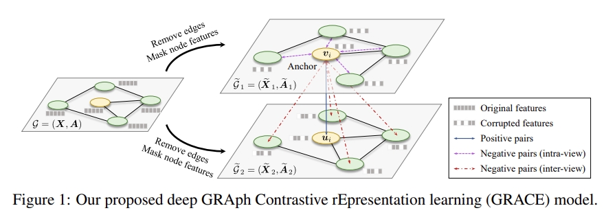

# GRACE



This is the code for the Paper: [deep **GRA**ph **C**ontrastive r**E**presentation learning (GRACE)](https://arxiv.org/pdf/2006.04131v2.pdf).

For a thorough resource collection of self-supervised learning methods on graphs, you may refer to [this](https://github.com/SXKDZ/awesome-self-supervised-learning-for-graphs) awesome list.

## Usage

Train and evaluate the model by executing
```
python train.py --dataset Cora
```
The `--dataset` argument should be one of [ Cora, CiteSeer, PubMed, DBLP ].

## Requirements

- torch 1.4.0
- torch-geometric 1.5.0
- sklearn 0.21.3
- numpy 1.18.1
- pyyaml 5.3.1

Install all dependencies using
```
pip install -r requirements.txt
```

If you encounter some problems during installing `torch-geometric`, please refer to the installation manual on its [official website](https://pytorch-geometric.readthedocs.io/en/latest/notes/installation.html).


## Citation

Please cite our paper if you use the code:

```
@inproceedings{Zhu:2020vf,
  author = {Zhu, Yanqiao and Xu, Yichen and Yu, Feng and Liu, Qiang and Wu, Shu and Wang, Liang},
  title = {{Deep Graph Contrastive Representation Learning}},
  booktitle = {ICML Workshop on Graph Representation Learning and Beyond},
  year = {2020},
  url = {http://arxiv.org/abs/2006.04131}
}
```
